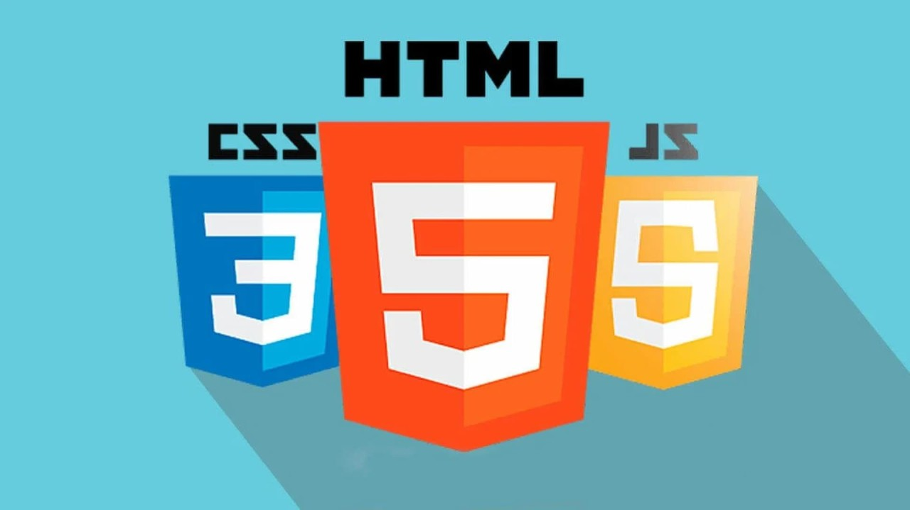

# Lenguaje de Marcas

Este repositorio está dedicado al primer año de lenguaje de marcas, es un repositorio con ejercicios resueltos que he ido haciendo durante todo el año en la UEM.

Se divide en los siguientes bloques:
- [T1 - **XML** Inicio del curso, trabajo con XML](https://github.com/JuanjoAJ/Lenguaje-de-Marcas/tree/main/T1-XML) 
- [T2 - **HTML** Primeros pasos en el manejo de HTML y Bootstrap](https://github.com/JuanjoAJ/Lenguaje-de-Marcas/tree/main/T2-HTML)
- [T3 - **RSS** Ejercicios de sindicación de contenido](https://github.com/JuanjoAJ/Lenguaje-de-Marcas/tree/main/T3-RSS)
- [T4 - **JS** Trabajo en Javascript](https://github.com/JuanjoAJ/Lenguaje-de-Marcas/tree/main/T4%20-%20Javascript)
- [T5 - **YAML** Los primeros pasos en el uso de YAML](https://github.com/JuanjoAJ/Lenguaje-de-Marcas/tree/main/T5%20%20-%20YAML)
- [T6 - **XPATH** Ejercicios relacionados con XPATH](https://github.com/JuanjoAJ/Lenguaje-de-Marcas/tree/main/T6%20-%20XPATH)
- [T7- **TypeScript** Inicios con el uso de Typescript](https://github.com/JuanjoAJ/Lenguaje-de-Marcas/tree/main/T7%20-%20TypeScript)
- [**Ejercicios Evaluables**](https://github.com/JuanjoAJ/Lenguaje-de-Marcas/tree/main/T0%20-%20Evaluables)
